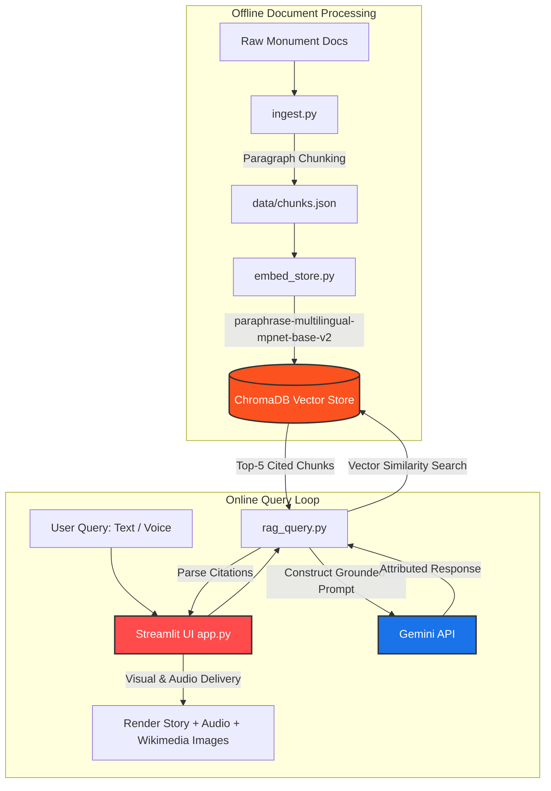

# Heritage Storytelling Engine

> **Unveiling India's rich history through interactive, multilingual, and personalized storytelling powered by Generative RAG.**

[](https://www.python.org/)
[](https://streamlit.io/)
[](https://www.trychroma.com/)
[](https://ai.google.dev/)
[](https://opensource.org/licenses/MIT)

---

## 📌 Problem Statement Summary
Exploring heritage sites often leaves visitors overwhelmed by dry, academic plaques or struggling with language barriers. The **Heritage Storytelling Engine** is a Retrieval-Augmented Generation (RAG) driven multilingual knowledge base and storytelling engine. It bridges the gap between historical data and engaging visitor experiences by dynamically synthesizing culturally rich, factually grounded stories tailored to a user's language, depth preference, and preferred interaction mode (voice or text).

---

## ✨ Key Features
- **🌐 Multilingual Story Generation**: Instantly generates narratives in **English, Hindi, and Tamil**, ensuring access for domestic and international travelers alike.
- **🛡️ Factually Grounded Citations**: Every generated story is strictly grounded in the local vector database, showing precise inline citation markers (e.g., `[1]`, `[2]`) linked back to original historical source files and snippets.
- **⚡ Dual Persona Settings**:
  - *Beginner Mode*: Engaging, simplified, tourist-friendly storytelling.
  - *Expert Mode*: Deep, detailed, academically rigorous history including dates, architectural terms, and cultural nuances.
- **🎙️ Speech-to-Text & Text-to-Speech**:
  - Speak your questions directly using **voice input**.
  - Listen to the stories narrated back to you using **voice output**.
- **🖼️ Automatic Wikimedia Imagery**: Dynamically queries the Wikimedia Commons API to fetch real, high-quality photograph representations of the monument currently being explored.
- **🎨 Glassmorphism Aesthetic UI**: A gorgeous, responsive frontend styled with an elegant, shifting sandstone/terracotta gradient background and modern, frosted-glass interface components.

---

## 🏗️ Architecture Overview

The pipeline implements an offline document processing loop and an online real-time query loop:



---

## 🛠️ Tech Stack
- **Programming Language**: Python 3.9+
- **Frontend / UI**: Streamlit (with customized CSS styling)
- **Vector Database**: ChromaDB (Persistent local storage)
- **Embedding Model**: `paraphrase-multilingual-mpnet-base-v2` (Sentence-Transformers)
- **Generative AI Engine**: Google Gemini API (`gemini-1.5-flash` / `gemini-1.5-pro` model)
- **Speech Processing**: 
  - `gTTS` (Google Text-to-Speech) for audio narration
  - `SpeechRecognition` for translating user voice input to text
- **Environment Management**: `python-dotenv`

---

## 🏛️ Current Scope (7 Heritage Sites Covered)
The knowledge base currently indexes verified historical records and descriptions for:
1. **Amber Fort** (Jaipur, Rajasthan)
2. **Hawa Mahal** (Jaipur, Rajasthan)
3. **Jaigarh Fort** (Jaipur, Rajasthan)
4. **Ajanta Caves** (Aurangabad, Maharashtra)
5. **Khajuraho Group of Monuments** (Chhatarpur, Madhya Pradesh)
6. **Red Fort** (Delhi)
7. **Taj Mahal** (Agra, Uttar Pradesh)
*(Note: Support for Qutub Minar and other archaeological zones is currently in active planning.)*

---

## 🚀 Setup & Installation (Local Execution)

Follow these steps to run the storytelling engine on your local computer:

### 1. Prerequisites
Ensure you have **Python 3.9** or higher installed.

### 2. Clone the Repository
```bash
git clone https://github.com/Harsh01-ux/virasat-rag-storytelling.git
cd virasat-rag-storytelling
```

### 3. Create a Virtual Environment
```bash
python -m venv venv
# Activate on Windows:
venv\Scripts\activate
# Activate on macOS/Linux:
source venv/bin/activate
```

### 4. Install Dependencies
```bash
pip install -r requirements.txt
```
> [!TIP]
> *For voice input, if you face issues installing `PyAudio` (required by SpeechRecognition) on Windows, run:*
> `pip install pipwin` and then `pipwin install pyaudio`

### 5. Setup Environment Variables
Create a file named `.env` in the root of the project and add your Gemini API Key:
```env
GEMINI_API_KEY=your_actual_gemini_api_key_here
```

### 6. Build the Vector Database (Ingest & Embed)
Run the ingestion pipeline to parse the text files and generate vector embeddings:
```bash
# Step 1: Chunk raw documents
python ingest.py

# Step 2: Generate embeddings and build ChromaDB store
python embed_store.py
```

### 7. Run the Streamlit Application
```bash
streamlit run app.py
```
Open your browser and navigate to `http://localhost:8501`.

---

## 🔗 Live Demo
🎥 **Check out the deployed application:** [Live Demo Link](https://github.com/Harsh01-ux/virasat-rag-storytelling) *(Placeholder)*

---

## 📸 Screenshots
*(Screenshots showing the Glassmorphism layout, multilingual translation, and citation interface will be uploaded here shortly.)*

| Shifting Sandstone Home | Multilingual Story Output |
|:---:|:---:|
| *Placeholder Image 1* | *Placeholder Image 2* |

---

## 🗺️ Future Scalability Roadmap
- [ ] **ASI Archives Integration**: Create a pipeline to auto-ingest documents from Archaeological Survey of India (ASI) official archives and museum API endpoints.
- [ ] **Vernacular Language Expansion**: Scale from 3 to 20+ recognized Indian languages, including Telugu, Kannada, Bengali, Marathi, and Gujarati.
- [ ] **Knowledge Graph Construction**: Layer a Neo4j Knowledge Graph on top of ChromaDB to model complex relationships between historic dynasties, battles, architectural elements, and centuries.

---

## 📄 License
This project is licensed under the MIT License - see the [LICENSE](LICENSE) file for details.
